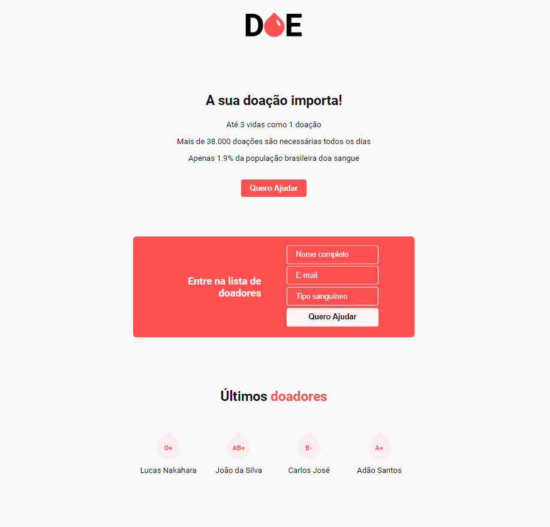

# Rocketseat MaratonaDev 3.0
## Briefing
Fictional blood donation campaign webpage developed with HTML/CSS, Javscript, Node.js and PostgreSQL in a free 2-days course offered by [Rocketseat](https://www.rocketseat.com.br).

### Technologies
##### Front-end
- HTML
- CSS
- Javascript

##### Back-end
- Node.js
    - Express
    - Nodemon
    - Nunjucks

- PostgreSQL

### Page

